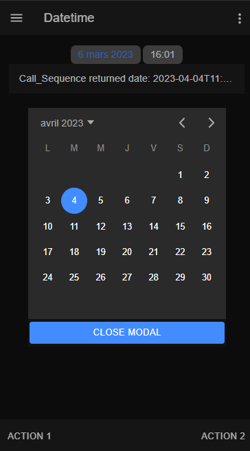
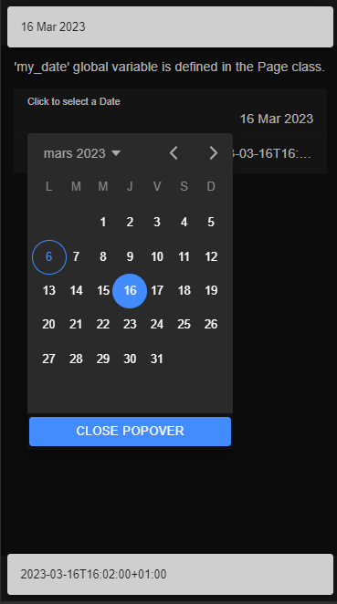

#  datetime

How to use DateTime

<i>Connectors</i>
<blockquote>

##  void

void connector, replace or don't use it

<i>Transactions</i>
<blockquote>

###  void

does nothing

</blockquote>

</blockquote>

<i>Sequences</i>
<blockquote>

##  data_by_date

Returns the 'date' variable

Variables

<table>
<tr>
<th>
name
</th>
<th>
comment
</th>
</tr>
<tr>
<td>
&nbsp;date
</td>
<td>

</td>
</tr>
</table>

</blockquote>

<i>Mobile Application</i>
<blockquote>

##  Application

NGX DateTime component usage.

<i>Pages</i>
<blockquote>

<b>Page_datetime_button</b> : <ul>
<blockquote>

###  Page_datetime_button

<ul>
<li>Use of custom tag ion-datetime-button.</li>
<li>Datetime picker is in a Modal component.</li>
<li>Date value bound to a global variable component ("my_picked_date").</li>
<li>Date value is used to call a sequence that returns the provided date when the close modal button is clicked.</li>
</ul>
 

</blockquote>

<b>Page_datetime_popover</b> : <ul>
<blockquote>

###  Page_datetime_popover

<ul>
<li>DateTime picker displayed by clicking the input.</li>
<li>Datetime picker is in a Popover component.</li>
<li>Date value is formatted in the input field ("dd MMM yyyy").</li>
<li>Unformatted Date value is used to call a sequence that returns the provided date on "ionChange" event of the input item (my_date value is declared in the Page class).</li>
<li>DateTime "ionChange" event is used to display value in a Toast component.</li>
</ul>
 

</blockquote>

</blockquote>

</blockquote>

